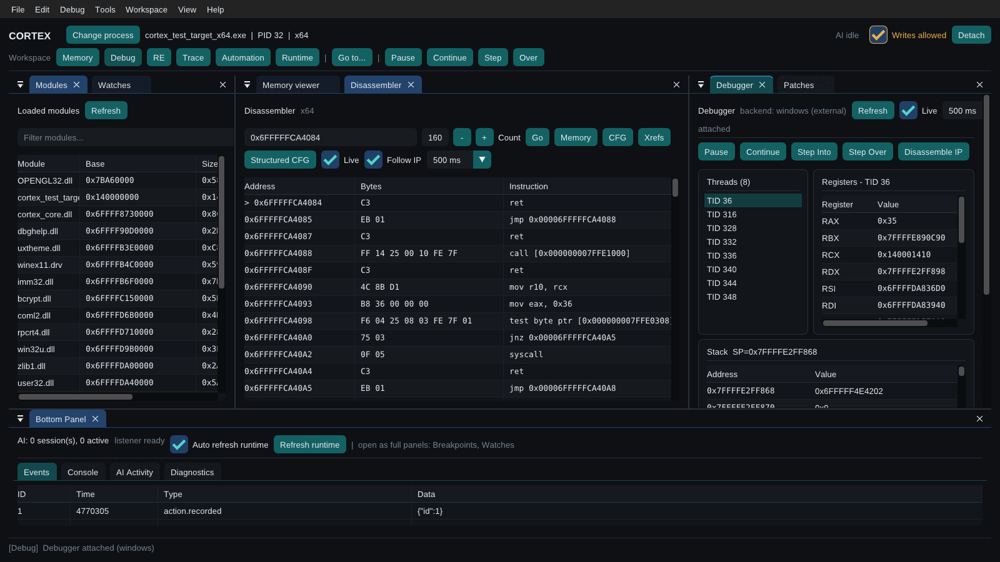
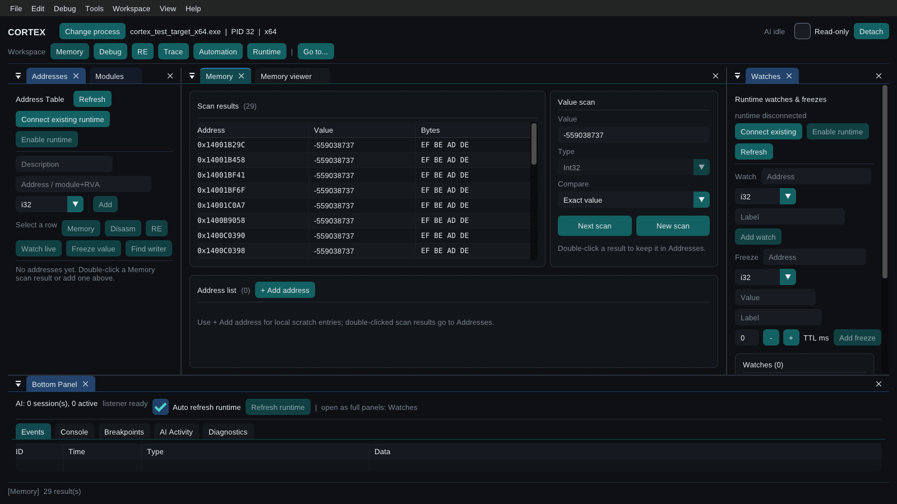
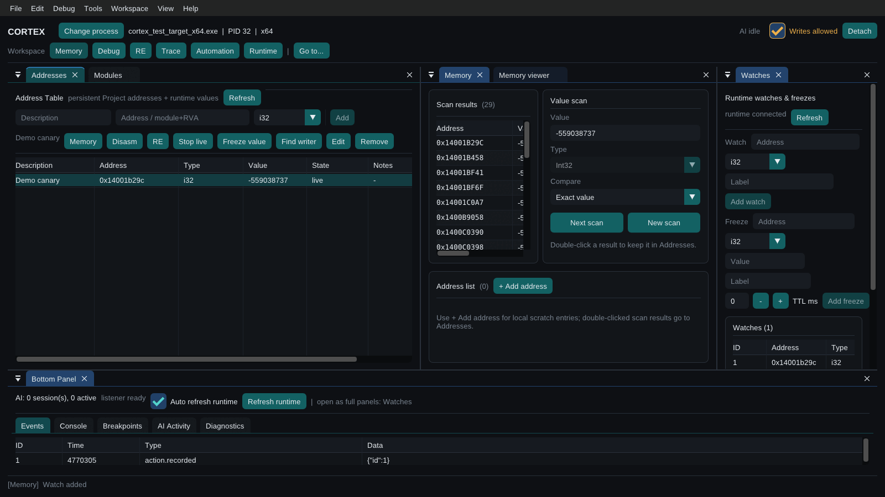
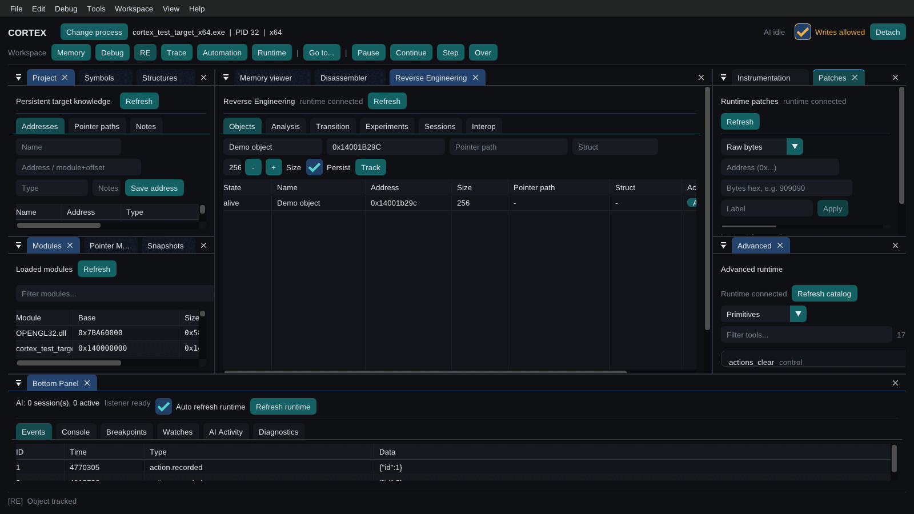
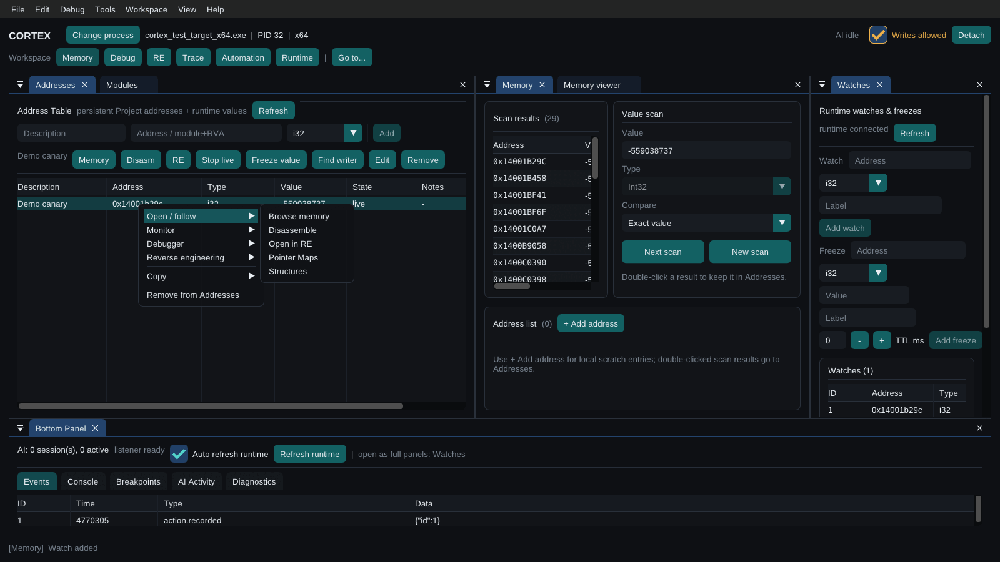
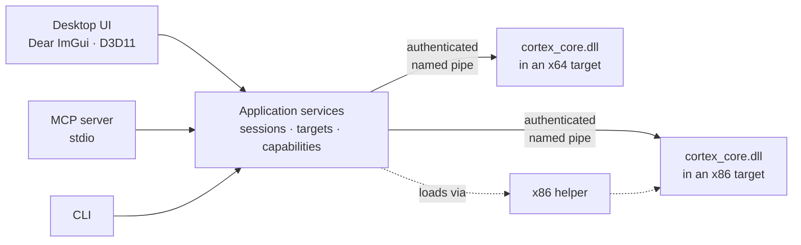

<div align="center">


# Cortex

**Runtime inspection, debugging and reverse engineering for Windows software, in one native app — with a first-class MCP server for AI agents.**

[](https://github.com/PdB333/cortex/releases)


[](LICENSE)

[Quick start](#quick-start) · [Features](#features) · [AI & MCP](#ai--mcp) · [Build](#build-from-source) · [Documentation](#documentation)

<br>



</div>

<br>

> [!WARNING]
> Use Cortex only on software and systems you own or are authorized to inspect. It is built for debugging, software research, accessibility, testing, diagnostics and controlled modding. Anti-cheat bypass, unauthorized access and interference with online services are out of scope.

## Why Cortex

- **One app, not a toolbox.** Scanner, memory viewer, disassembler, debugger, patcher, tracer, RE workspace, scripting and diagnostics share one target, one address menu and one project.
- **Safe by default.** Every session starts **Read-only**. In the desktop, writes, freezes, patches, breakpoints and even loading the runtime into the target require the **Writes allowed** switch. An AI client starts read-only too and cannot lift that itself: only the person who launches `cortex.exe mcp --allow-writes` can, and a call that changes the target must also say so (`mutation_permission`). Every refused attempt is logged to `cortex_denied_mutations.jsonl`.
- **Built for agents too.** `cortex.exe mcp` is a native MCP server: attach processes on the fly, drive several targets at once, and let the person at the screen watch every tool call live.
- **Light and portable.** A native Dear ImGui + Direct3D 11 desktop, no Qt or runtime installer. Unzip, run, and keep your settings per user — or beside the executable with a `cortex.portable` file.

## Quick start

1. Download **`cortex-v1.0.0-windows-portable.zip`** from the [latest release](https://github.com/PdB333/cortex/releases) and extract the whole archive.
2. Run **`cortex.exe`**, click **Select process** and attach to your target.
3. Find a value in **Memory › Value scan** (*First scan*, change it in the target, *Next scan*).
4. Double-click a result to keep it in **Addresses**, then right-click it to open it in the Memory viewer, Disassembler, Debugger or RE.
5. Switch the header to **Writes allowed** only when you mean to change something.

New to Cortex? Follow the [illustrated walkthrough](docs/ui-walkthrough.md) ([français](docs/ui-walkthrough-fr.md)).

## Features

<table>
<tr>
<td width="50%" valign="top">

**Memory**
Cheat Engine level scanning — every type (byte through double, string, array of bytes with wildcards, all numeric), exact / comparative / unknown-initial scans and *by* deltas, region-type and protection filters, fast scan and threads. An address list with freezes, `module+offset` and pointer entries, full address expressions, groups, colours, dropdowns and per-entry global hotkeys, that opens and saves Cheat Engine `.CT` tables. A 64 KB hex viewer with change highlighting and a data inspector, pointer maps, a pointer scanner and a **pointer spider** (list or node graph), **structure dissect** across several instances, grouped scans, user-defined value types, memory dumps to file, structures with inference, snapshots with diff and rewind.

</td>
<td width="50%" valign="top">

**Code**
Zydis-backed x86/x64 disassembly that can follow the instruction pointer, CFG, structured CFG and cross-references, symbols (PDB and DWARF), an x86/x64 **assembler** and Auto-Assembler style **code injection** (allocate a cave, relocate the replaced instructions, jump and return, restore), AOB signatures, and reversible patches: bytes, NOP, assembly, detours, trampolines and code caves. **Auto Assembler** scripts (`[ENABLE]` / `[DISABLE]`, `alloc`, `aobscan`, `registersymbol`, …) live in the address list and in `.CT` tables, and a **speedhack** scales the target's clock.

</td>
</tr>
<tr>
<td valign="top">

**Debugging**
Threads, registers and stack at a glance; software and hardware breakpoints with hit counters, thread coverage and hit logs; pause, continue, step into and step over; per-thread traces with register snapshots. External Windows debugger or in-process VEH backend.

</td>
<td valign="top">

**Reverse engineering**
Tracked objects with liveness and field-change events, last-writer and C++ subobject detection, transition tracing, experiments with automatic rollback, persistent facts, checkpoints, run export and diff, Ghidra interop.

</td>
</tr>
<tr>
<td valign="top">

**Observe & automate**
A Cheat Engine compatible **Lua engine** that reads and writes the target from outside (AOB scans, symbols, module walks, byte tables) with no runtime injected; "what accesses / writes an address" and instruction watches through hardware breakpoints; page-access and allocation instrumentation, network events, screenshots, input sequences with record and replay, and a reversible action journal for everything that changed.

</td>
<td valign="top">

**Diagnostics**
Crash and hang capture from outside the process, minidumps, symbolized stacks, hook verification, breadcrumbs and an evidence-based analyzer — plus a C++ SDK mods can use to add context.

</td>
</tr>
</table>

## A workspace for every task

Every panel is a dockable window. Six presets arrange them for the job at hand, and the layout is remembered.

| Preset | What you get |
|---|---|
| **Memory** | Value scan, Addresses, Memory viewer, Memory tools, Modules, Watches |
| **Debug** | Disassembler, Debugger, What accesses, Patches, Memory viewer, Modules, Watches |
| **RE** | Reverse Engineering, Project, Symbols, Structures, Pointer Maps, Snapshots, Memory tools, Instrumentation |
| **Trace** | Trace, Disassembler, Debugger, Memory viewer, Watches |
| **Automation** | Lua engine, Scripts, Input, Actions, Events |
| **Runtime** | Advanced tools, Diagnostics, Network, Screenshots, Sessions, Settings |

<table>
<tr>
<td width="50%"><br><sub><b>Value scan</b> — first and next scans with typed results</sub></td>
<td width="50%"><br><sub><b>Addresses</b> — the persistent working table, with live watches</sub></td>
</tr>
<tr>
<td><br><sub><b>RE preset</b> — tracked objects, project knowledge and runtime tools</sub></td>
<td><br><sub><b>One address menu</b> — open, monitor, debug, analyze or copy from anywhere</sub></td>
</tr>
</table>

**Keyboard:** `Ctrl+G` go to an address, `module+offset` or symbol · `Ctrl+Shift+P` / `Ctrl+K` command palette · `Alt+←` / `Alt+→` navigation history · `Space` freeze · `F2` edit · `Ctrl+B` breakpoint.

## AI & MCP

MCP is built into `cortex.exe`. Configure your client once; the server starts targetless and attaches processes when asked.

```json
{
  "mcpServers": {
    "cortex": { "command": "C:/Cortex/cortex.exe", "args": ["mcp"] }
  }
}
```

That server is read-only and attaches only to a process whose runtime is already loaded (`cortex.exe inject <pid>`, or the desktop). To let the agent load the runtime and change the target, add `"--allow-writes"` to `args`; that is your decision, not the agent's.

- **Dynamic targets** — `cortex_processes`, `cortex_attach`, `cortex_targets`, `cortex_detach`, with `tools/list_changed` notifications.
- **Many targets, no races** — each attached process has its own runtime connection; tools take a `_cortex_target` selector.
- **Compact by default** — 30 semantic tools that run the bounded steps the agent writes and return the raw evidence; `--tools all` exposes every primitive. Cortex does not score or interpret results for the agent.
- **Guarded** — a state-changing call needs two things: `mutation_permission=true` in the call (the agent saying it means to) and write authority from outside the model (`--allow-writes` on the command line). Supported changes run inside rollback-aware transactions. Human test prompts can only be answered by the person, in the desktop. Known limit: the pipe token is a file the same Windows user can read, so an agent that also has a shell or file access is not held back by any of this.
- **Visible** — the desktop's **AI Activity** panel shows each agent session and tool call as it happens.

```text
AI client ──stdio──▶ cortex.exe mcp ──authenticated named pipe──▶ cortex_core.dll (in target)
```

Details: [MCP internals](docs/mcp.md) · [Agent guide](agent/agents.md) · [Semantic tools](agent/semantic-tools.md)

## Command line

```powershell
cortex.exe                      # desktop application
cortex.exe mcp [--pid N | --process name] [--tools compact|all]
cortex.exe probe --pid 1234     # read-only target and runtime health
cortex.exe diagnose --pid 1234  # crash and hang watcher
cortex.exe analyze <folder>     # offline crash analysis
cortex.exe symbolize [options]  # PDB / DWARF lookup
cortex.exe inject <target>      # load the runtime
```

## How it fits together



The desktop runs in its own process and draws nothing inside the target. The runtime is loaded only when a feature needs to run in-process; from the desktop, only with writes allowed. See [architecture](docs/unified-app-architecture.md).

## Portable bundle

```text
Cortex/
├─ cortex.exe                      desktop, CLI and MCP
└─ runtime/
   ├─ x64/cortex_core.dll          runtime for 64-bit targets
   └─ x86/cortex_core.dll          runtime for 32-bit targets
      x86/cortex_runtime_helper.exe
```

There is one runtime per architecture because Windows cannot load a 64-bit DLL into a 32-bit process, or the reverse. You never pick one: the desktop, `cortex.exe mcp` and `cortex.exe inject <pid>` read the target's architecture and use the matching runtime, going through the private x86 helper for 32-bit targets.

Settings (`cortex-ui-settings.json`) and the dock layout (`cortex-ui.ini`) live in `%LOCALAPPDATA%\Cortex`. Create an empty `cortex.portable` beside `cortex.exe` to keep them next to the executable; files from an earlier version are copied over on first start.

## Build from source

Requirements: Windows, CMake 3.21+, Ninja and a C++17 compiler (CI uses MSYS2 MinGW-w64). Dear ImGui, cpp-httplib, nlohmann/json and Zydis are fetched at pinned revisions.

```powershell
# Desktop application
cmake -S app_imgui -B build/ui -G Ninja -DCMAKE_BUILD_TYPE=Release
cmake --build build/ui --parallel

# In-target runtime (per architecture)
cmake -S . -B build/runtime-x64 -G Ninja -DCMAKE_BUILD_TYPE=Release -DBUILD_TESTING=OFF
cmake --build build/runtime-x64 --target core
```

`-DBUILD_TESTING=ON` adds the GUI smoke modes and the application-model unit tests to `ctest`; `-DCORTEX_IMGUI_TEST_MODES=OFF` builds `cortex.exe` without the GUI test modes. For hands-on testing, prefer the CI portable artifact, which bundles matching x64/x86 runtimes.

## Quality gates

Version 1.0 was also exercised by hand on a real game (AssaultCube 1.3.0.2): scans, freezes, code injection, what-accesses, pointer scans, dissect and spider, `.CT` round trips, hotkeys and Lua, with screenshots.

Every change is checked on Windows by CI: the desktop build with headless, native-window, workspace, attached-target, multi-session and cross-bitness GUI suites; x64 and x86 runtimes; integrated MCP end-to-end tests that also call every read-only tool; private prompt and event channels; project, patch, snapshot, script, input, instrumentation, symbol and structure contracts; portable dependency closure; and the MCP schema, protocol and semantic contracts grouped in [`contracts.yml`](.github/workflows/contracts.yml).

Automated validation does not replace testing against real, authorized targets.

## Documentation

| | |
|---|---|
| [Getting started](docs/getting-started.md) | First run, attach, scan, Addresses, write permission, manual checklist |
| [Illustrated walkthrough](docs/ui-walkthrough.md) · [FR](docs/ui-walkthrough-fr.md) | The main workflow, screen by screen |
| [UI guide](docs/ui-guide.md) | Every workspace, menu, shortcut and setting |
| [MCP internals](docs/mcp.md) | Transport, routing, security, semantic execution |
| [Agent guide](agent/agents.md) | How an AI agent should drive Cortex |
| [Architecture](docs/unified-app-architecture.md) | Product and runtime layering |
| [Diagnostics](docs/external-diagnostics.md) · [Symbols](docs/symbols.md) · [Hooks](docs/hooks.md) · [Mod SDK](docs/mod-sdk.md) | Crash and hang tooling |
| [Changelog](CHANGELOG.md) | Release history |

All documents are indexed in [`docs/README.md`](docs/README.md).

## License

[MIT](LICENSE) © 2026 PdB333
