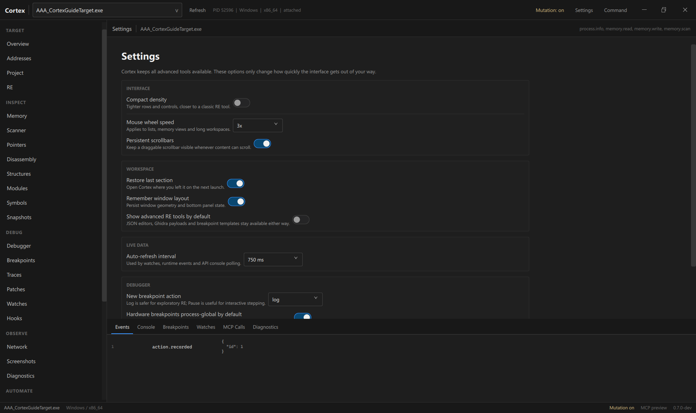

# Procédure illustrée — Cortex UI

Cette procédure montre le parcours principal de la version Qt/QML de Cortex : sélectionner une cible, scanner une valeur, conserver une adresse, naviguer dans la mémoire et le désassemblage, puis passer aux outils RE.

Les captures ci-dessous ont été réalisées directement sur le build Windows unifié de Cortex avec une petite cible locale de démonstration (`AAA_CortexGuideTarget.exe`). La valeur `123456789` et les adresses visibles sont uniquement des données de démonstration.

> Utilise Cortex uniquement sur un logiciel ou un système que tu possèdes ou que tu es autorisé à inspecter.

## 1. Lancer Cortex et choisir une cible

Lance `cortex.exe`, puis clique sur le sélecteur de processus dans la barre supérieure. Tu peux utiliser le champ de recherche pour filtrer par nom, PID ou chemin.


Clique sur le processus voulu. Cortex effectue l'attachement et conserve ensuite le nom de la cible dans la barre supérieure et dans la barre d'état.

## 2. Vérifier l'attachement

Dans **Overview**, vérifie au minimum :

- le nom du processus ;
- la plateforme et l'architecture ;
- **Session: Attached** ;
- **Mutation: Disabled** au départ.


Cortex démarre volontairement en mode observation. Tant que tu lis, scannes ou désassembles sans modifier la cible, laisse **Mutation off**.

## 3. Scanner une valeur

Ouvre **Scanner** dans la sidebar ou presse `Ctrl+F`.

Pour un scan classique :

1. choisis le type (`i32`, `i64`, `f32`, etc.) ;
2. saisis la valeur actuelle ;
3. clique **New Scan** ;
4. fais évoluer la valeur dans la cible si nécessaire ;
5. utilise **Next Scan** avec une nouvelle valeur ou un mode comparatif : Changed, Unchanged, Increased ou Decreased.

Dans la capture de démonstration, Cortex trouve quatre occurrences de la valeur `123456789`.


Un clic droit sur un résultat donne directement accès aux actions liées à cette adresse. Un double-clic envoie l'adresse vers **Addresses**.

### Mutation et ajout dans Addresses

Avec **Mutation off**, Cortex peut ouvrir l'adresse dans le workspace Addresses sans effectuer l'écriture persistante associée au projet. Active **Mutation** uniquement au moment où tu veux enregistrer/modifier l'état Cortex ou la cible.

## 4. Utiliser Addresses comme table de travail

**Addresses** est le centre du workflow de type Cheat Engine. Une entrée contient :

- Description ;
- Address ;
- Type ;
- Value ;
- State ;
- Notes.

Dans la capture suivante, l'entrée de démonstration s'appelle `Demo health`. Le live watch a été activé afin que Cortex suive sa valeur.


Raccourcis utiles dans Addresses :

| Raccourci | Action |
|---|---|
| `Space` | Freeze / unfreeze |
| `F2` | Modifier l'entrée |
| `Delete` | Supprimer l'entrée lorsque Mutation est autorisée |
| `Ctrl+B` | Ajouter un software breakpoint lorsque le runtime est disponible |

Un double-clic sur une entrée ouvre la mémoire à cette adresse.

## 5. Exploiter le menu contextuel d'adresse

Le même menu d'adresse est utilisé dans **Addresses**, **Scanner**, **Memory**, **Disassembly** et le désassemblage du Debugger.


Selon la cible et les permissions, tu peux notamment :

- Browse memory ;
- Disassemble ;
- Open in RE ;
- Add to Addresses ;
- Add software breakpoint ;
- Find what writes ;
- Find what accesses ;
- Pointer scan ;
- Open in Structures ;
- Track object in RE ;
- Detect C++ subobjects ;
- créer un snapshot local ;
- copier l'adresse ou `module+offset`.

Ce menu est le moyen le plus rapide de continuer l'analyse sans recopier les adresses entre les outils.

## 6. Inspecter la mémoire

Dans **Memory**, Cortex affiche la mémoire en lignes de 16 octets avec vue hexadécimale et ASCII.


Le bloc **Write** est volontairement séparé et marqué comme action de Mutation. Pour une simple inspection, ne l'utilise pas.

Tu peux également utiliser `Ctrl+G` pour aller directement vers :

```text
0x7FF612340000
game.exe+0x1234
KnownSymbolName
```

Le popup Go To permet d'ouvrir le résultat dans Memory, Disassembly, RE ou Addresses.

## 7. Passer au désassemblage

**Disassembly** permet de naviguer dans le code autour d'une adresse, avec historique Back / Forward.


Les actions d'analyse principales sont :

- **CFG** — graphe de contrôle ;
- **Xrefs** — références vers/depuis la zone analysée ;
- **Structured CFG** — analyse structurée de la fonction ;
- clic droit — même menu contextuel d'adresse que dans les autres workspaces.

`Ctrl+B` peut poser un software breakpoint lorsque Mutation et le runtime sont disponibles.

## 8. Utiliser le Debugger

Dans **Debugger**, **Enable Runtime** active l'instrumentation nécessaire lorsque celle-ci n'est pas encore connectée.

Le workspace regroupe notamment :

- threads et threads pausés ;
- instruction pointer ;
- registres ;
- désassemblage autour de l'IP ;
- breakpoints ;
- Continue ;
- Step Into.

Les actions de contrôle de la cible nécessitent Mutation.

> Limitation actuelle de l'UI : les boutons **Pause** et **Step Over** sont visibles mais désactivés. Ils ne doivent pas être considérés comme des contrôles interactifs terminés dans cette version.

## 9. Continuer dans RE

Pour l'analyse runtime plus poussée, ouvre l'adresse dans **RE**.


Le workspace RE fournit notamment :

- tracked objects ;
- Quick Analysis ;
- Last writer ;
- détection de sous-objets C++ ;
- trace des écritures / transitions ;
- faits RE persistants ;
- expériences avec rollback ;
- sessions et checkpoints ;
- outils avancés JSON/Ghidra lorsqu'ils sont affichés.

Le parcours recommandé est :

```text
Scanner -> Addresses -> Memory / Disassembly -> RE
                           |             |
                           +-> Pointers <-+
                           +-> Structures
                           +-> Debugger
```

## 10. Régler l'interface

Le bouton **Settings** dans la barre supérieure ouvre les préférences de l'application.



Les réglages actuels comprennent notamment :

- densité compacte ;
- vitesse de la molette ;
- scrollbars persistantes ;
- restauration de la dernière section ;
- mémorisation du layout ;
- affichage des outils RE avancés ;
- intervalle d'auto-refresh ;
- action par défaut des nouveaux breakpoints ;
- comportement des hardware breakpoints.

**Mutation n'est volontairement pas mémorisée comme préférence activée.** Après un nouvel attach, elle repart désactivée.

## Raccourcis globaux

| Raccourci | Action |
|---|---|
| `Ctrl+F` | Scanner + focus sur la valeur |
| `Ctrl+G` | Go To global |
| `Ctrl+Shift+P` ou `Ctrl+K` | Command Palette |
| `Ctrl+J` | Afficher/masquer le bottom panel |
| `Ctrl+B` | Breakpoint dans les vues compatibles |

## Bottom panel

Le panneau inférieur contient :

- Events ;
- Console ;
- Breakpoints ;
- Watches ;
- MCP Calls ;
- Diagnostics.

Il permet de garder les informations live visibles sans quitter le workspace principal.

## Checklist rapide pour tester un build

- [ ] sélectionner puis attacher une cible ;
- [ ] vérifier Overview ;
- [ ] faire un New Scan puis un Next Scan ;
- [ ] envoyer une adresse vers Addresses ;
- [ ] vérifier la valeur live ;
- [ ] essayer `Ctrl+G` ;
- [ ] ouvrir Memory et Disassembly ;
- [ ] tester un changement réversible avec Mutation sur une cible sûre ;
- [ ] activer le runtime et vérifier Debugger ;
- [ ] ouvrir une adresse dans RE ;
- [ ] détacher puis rattacher proprement ;
- [ ] fermer Cortex sans crash.

Pour la référence complète de chaque workspace, voir [Cortex UI guide](ui-guide.md). Pour le parcours sans captures, voir [Getting started](getting-started.md).