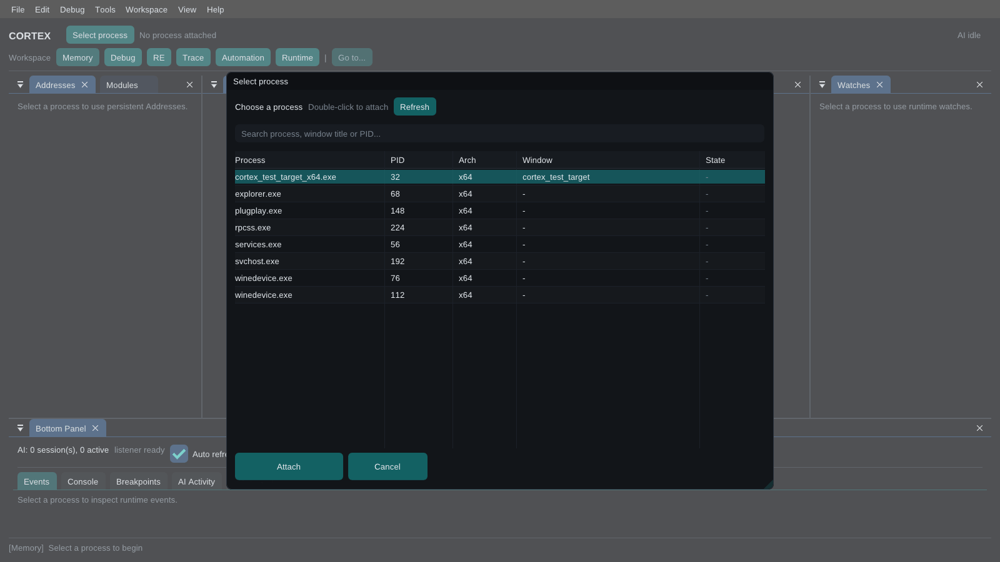
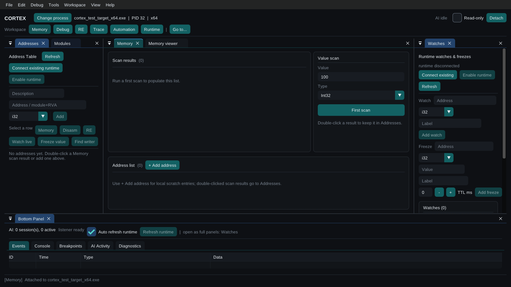
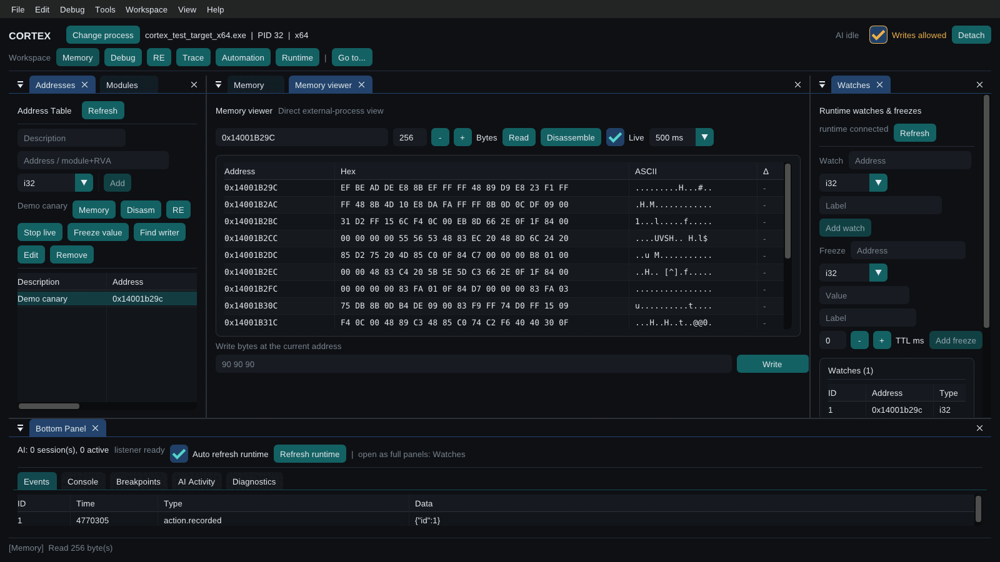
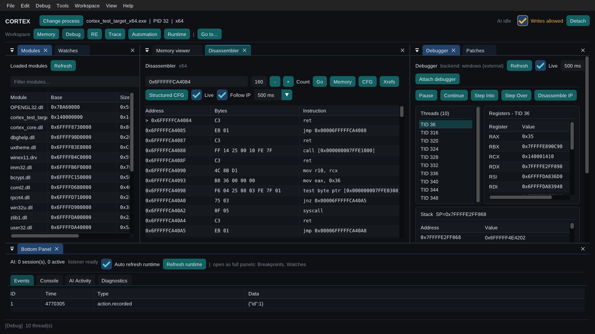
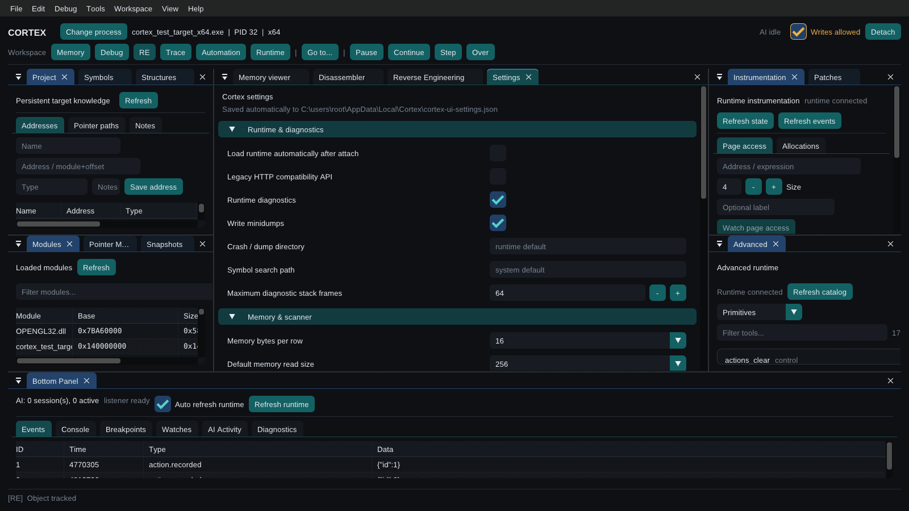

# Procédure illustrée — Cortex UI

Cette procédure montre le parcours principal de l'application de bureau Cortex : sélectionner une cible, scanner une valeur, conserver une adresse, naviguer dans la mémoire et le désassemblage, utiliser le débogueur, puis passer aux outils RE.

Les captures ont été réalisées avec Cortex v1.0 (Dear ImGui) attaché à la cible de test du dépôt, `cortex_test_target_x64.exe`. La valeur scannée `0xDEADBEEF` (`-559038737` en entier signé 32 bits) et les adresses visibles sont uniquement des données de démonstration.

> Utilise Cortex uniquement sur un logiciel ou un système que tu possèdes ou que tu es autorisé à inspecter.

## La fenêtre en un coup d'œil

- **Barre de menus** : File (choisir un processus, détacher), Edit (palette de commandes, Go To, Settings), Debug, Tools, Workspace (presets), View (ouvrir ou fermer chaque espace de travail, précédent/suivant), Help.
- **En-tête, ligne 1** : la cible (processus, PID, architecture), l'interrupteur **Read-only / Writes allowed** et **Detach**.
- **En-tête, ligne 2** : les six presets d'espaces de travail, **Go to...**, puis les commandes du débogueur une fois celui-ci attaché.
- **Zone d'ancrage** : chaque espace de travail est une fenêtre ancrable. Glisse un onglet pour le déplacer, un séparateur pour redimensionner ; la disposition est enregistrée par utilisateur.
- **Panneau du bas** : Events, Console, Breakpoints, Watches, AI Activity et Diagnostics.
- **Ligne d'état** : le résultat de la dernière action, précédé du preset actif.

## 1. Lancer Cortex et choisir une cible

Lance `cortex.exe`, puis clique **Select process** (ou **File > Select process...**). Le champ de recherche filtre par nom de processus, titre de fenêtre ou PID.



Sélectionne une ligne et clique **Attach**, ou double-clique la ligne.

Tu peux rouvrir le sélecteur et attacher un second processus. Cortex garde les deux sessions et passe de l'une à l'autre depuis l'en-tête sans en détacher aucune.

## 2. Vérifier l'attachement

Après l'attachement, l'en-tête affiche le nom du processus, son PID et son architecture, et le preset **Memory** s'ouvre : Addresses et Modules à gauche, Memory et le Memory viewer au centre, Watches à droite.



L'interrupteur indique **Read-only**. Cortex démarre en mode observation : lire, scanner, désassembler et inspecter fonctionnent sans écriture, et rien n'est injecté dans la cible.

## 3. Scanner une valeur

Le panneau **Value scan** de l'espace **Memory** lance les scans exacts et comparatifs.

1. choisis le type (`Int32`, `Int64`, `Float`, `Double`, `String`, `Bytes`) ;
2. saisis la valeur actuelle ;
3. clique **First scan** ;
4. fais évoluer la valeur dans la cible ;
5. clique **Next scan** avec une nouvelle valeur exacte ou un mode comparatif : Changed, Unchanged, Increased ou Decreased ;
6. **New scan** repart de zéro.

Dans la démonstration, Cortex a trouvé 29 occurrences de `-559038737`.


Quand un scan atteint la limite de résultats configurée, le compteur est suivi de **limit reached** et la ligne d'état précise que les autres correspondances n'ont pas été conservées ; affine la valeur ou augmente **Maximum scan results** dans Settings.

Clic droit sur un résultat : menu d'adresse partagé. Double-clic : prépare une entrée **Addresses**.

## 4. Utiliser Addresses comme table de travail

**Addresses** est la table de travail persistante du projet de la cible. Chaque entrée a une description, une adresse, un type, une valeur live, un état et des notes.

Le double-clic sur un résultat remplit l'adresse ; ajoute une description et clique **Add**. Ajouter au projet est une écriture : passe d'abord l'interrupteur de l'en-tête sur **Writes allowed** (le bouton **Add** reste désactivé sinon).

Sélectionne une entrée pour accéder à ses actions : **Memory**, **Disasm**, **RE**, **Watch live**, **Freeze value**, **Find writer**, **Edit** et **Remove**. Avec **Watch live**, le runtime rafraîchit la valeur et l'état passe à `live` ; la surveillance apparaît aussi dans l'espace Watches.


Raccourcis dans Addresses :

| Raccourci | Action |
|---|---|
| `Space` | Geler / dégeler l'entrée sélectionnée (écritures autorisées) |
| `F2` | Modifier l'entrée sélectionnée |
| `Delete` | Supprimer l'entrée sélectionnée (écritures autorisées) |
| `Ctrl+B` | Poser un breakpoint logiciel sur l'entrée sélectionnée (écritures autorisées) |

## 5. Utiliser le menu d'adresse partagé

Le même menu est disponible depuis Addresses, les résultats de scan, le Memory viewer, le Disassembler, les registres et la pile du débogueur.


Il est organisé par intention :

- **Open / follow** : Browse memory, Disassemble, Open in RE, Pointer Maps, Structures ;
- **Monitor** : Add live watch, Find what accesses (page watch), Snapshot 64 bytes ;
- **Debugger** : breakpoint logiciel, breakpoints matériels exécution / écriture / lecture-écriture ;
- **Reverse engineering** : Find what writes, Track object, Detect C++ subobjects, Add to Addresses ;
- **Copy** : l'adresse absolue ou la forme `module+offset`.

Les actions qui modifient la cible sont désactivées tant que l'en-tête indique Read-only.

## 6. Inspecter la mémoire

Le **Memory viewer** affiche adresse, hexadécimal et ASCII, 16 octets par ligne par défaut. **Live** relit à l'intervalle choisi, et les octets modifiés sont signalés dans la colonne **Δ**.



La ligne **Write bytes at the current address** est une écriture ; elle n'est active qu'avec **Writes allowed**.

`Ctrl+G` (ou **Go to...**) ouvre Go To. Il accepte :

```text
0x7FF612340000
game.exe+0x1234
KnownSymbolName
```

et ouvre l'emplacement dans le Memory viewer ou le Disassembler. `Alt+Gauche` et `Alt+Droite` naviguent dans l'historique des emplacements.

## 7. Passer au Disassembler

Le preset **Debug** place Modules et Watches à gauche, le Disassembler et le Memory viewer au centre, le Debugger et Patches à droite.



Le Disassembler affiche adresse, octets et instruction. **Follow IP** le cale sur le pointeur d'instruction du thread sélectionné (`>` marque l'instruction courante). Actions d'analyse :

- **CFG** : graphe de flot de contrôle de la fonction ;
- **Xrefs** : références vers et depuis la zone analysée ;
- **Structured CFG** : analyse structurée de la fonction ;
- clic droit : le menu d'adresse partagé.

## 8. Utiliser le débogueur

Le Debugger liste les threads, les registres et la pile du thread sélectionné, visibles avant même d'attacher un débogueur. Clic droit sur un registre ou une valeur de pile : menu d'adresse ; double-clic sur une valeur de pile : navigation mémoire.

Clique **Attach debugger** pour contrôler la cible. L'en-tête affiche alors **Pause**, **Continue**, **Step** et **Over**, les mêmes commandes que l'espace Debugger et le menu **Debug**.


L'espace Debugger regroupe :

- les threads, et ceux arrêtés sur un breakpoint ;
- les registres et la pile du thread sélectionné ;
- les breakpoints avec compteurs et journal des hits ;
- **Pause**, **Continue**, **Step Into**, **Step Over** et **Disassemble IP**.

Le contrôle de la cible exige **Writes allowed**. Quand le panneau est étroit, la pile passe sous les threads et les registres.

## 9. Continuer vers RE

Le preset **RE** ouvre Reverse Engineering au centre ; Project, Symbols, Structures, Pointer maps, Snapshots et Modules à gauche ; Instrumentation, Patches et les outils runtime à droite.


Les onglets de l'espace RE :

- **Objects** : objets suivis (adresse ou chemin de pointeurs, taille, structure facultative) avec état de vie, événements de modification des champs et analyse par objet ;
- **Analysis** : dernier écrivain, détection des sous-objets C++ ;
- **Transition** : traçage d'une transition d'état ;
- **Experiments** : test contrôlé, avec rollback automatique en option ;
- **Sessions** : faits RE, checkpoints et rollback, export et diff des runs ;
- **Interop** : export et import Ghidra, modèles de breakpoints.

Progression recommandée :

```text
Value scan -> Addresses -> Memory viewer / Disassembler -> RE
                              |                 |
                              +-> Pointer maps <-+
                              +-> Structures
                              +-> Debugger
```

## 10. Configurer l'interface

Ouvre **Edit > Settings**. Les changements sont enregistrés immédiatement ; le chemin du fichier de réglages est affiché en haut.



Sections :

- **Runtime & diagnostics** : chargement automatique du runtime après attachement, API HTTP héritée, diagnostics runtime, minidumps, dossier des crashs, chemin de recherche des symboles, nombre de frames ;
- **Memory & scanner** : octets par ligne, taille de lecture, type de scan par défaut, nombre maximal de résultats ;
- **Debugger & trace** : backend du débogueur, action par défaut des breakpoints, breakpoints matériels globaux au processus, budget de pas et taille de page des traces ;
- **Projects & sessions** : dossiers des projets et des exports de session, rétention de l'historique ;
- **MCP & AI activity** : profil d'outils MCP par défaut, historique d'activité IA, statut IA dans l'en-tête, rafraîchissement automatique.

**Writes allowed n'est volontairement pas mémorisé.** Chaque nouvel attachement démarre en lecture seule.

Les réglages et la disposition sont stockés dans `%LOCALAPPDATA%\Cortex`. Crée un fichier vide `cortex.portable` à côté de `cortex.exe` pour les garder à côté de l'exécutable.

## Raccourcis globaux

| Raccourci | Action |
|---|---|
| `Ctrl+G` | Go To |
| `Ctrl+Shift+P` ou `Ctrl+K` | Palette de commandes |
| `Alt+Gauche` / `Alt+Droite` | Précédent / suivant |
| `Ctrl+B` | Breakpoint sur l'entrée Addresses sélectionnée |

## Panneau du bas

Le panneau du bas contient Events, Console, Breakpoints, Watches, AI Activity et Diagnostics. Quand l'un d'eux est déjà ouvert comme espace de travail complet, son onglet est masqué et le panneau le signale sous « open as full panels », pour ne jamais afficher deux fois les mêmes données.

## Checklist de validation rapide

- [ ] sélectionner et attacher une cible ;
- [ ] vérifier l'en-tête : processus, PID, architecture, Read-only ;
- [ ] lancer un First scan puis un Next scan ;
- [ ] ajouter une adresse utile dans Addresses et la surveiller en live ;
- [ ] tester `Ctrl+G` ;
- [ ] ouvrir le Memory viewer et le Disassembler ;
- [ ] autoriser les écritures et tester uniquement un changement sûr et réversible ;
- [ ] attacher le débogueur et faire avancer un thread pas à pas ;
- [ ] suivre un objet dans RE ;
- [ ] détacher puis rattacher proprement ;
- [ ] fermer Cortex sans crash.
