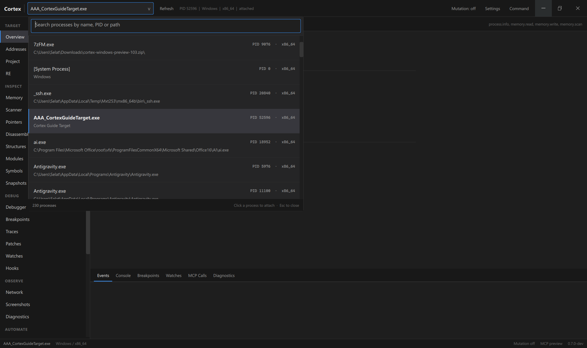
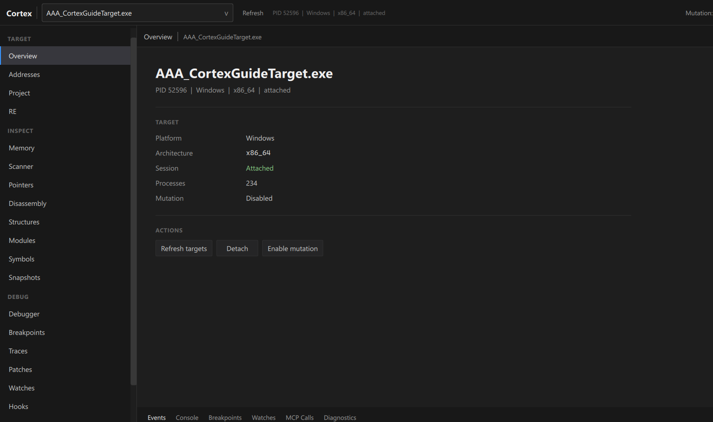
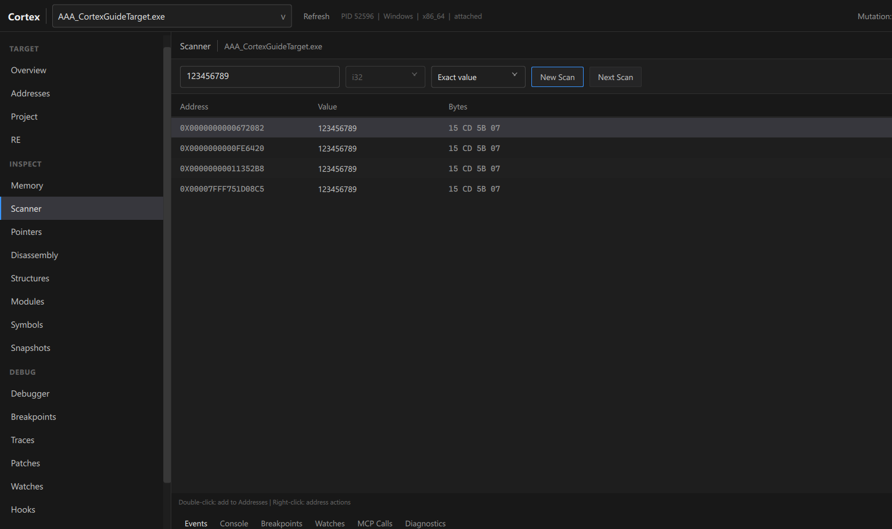
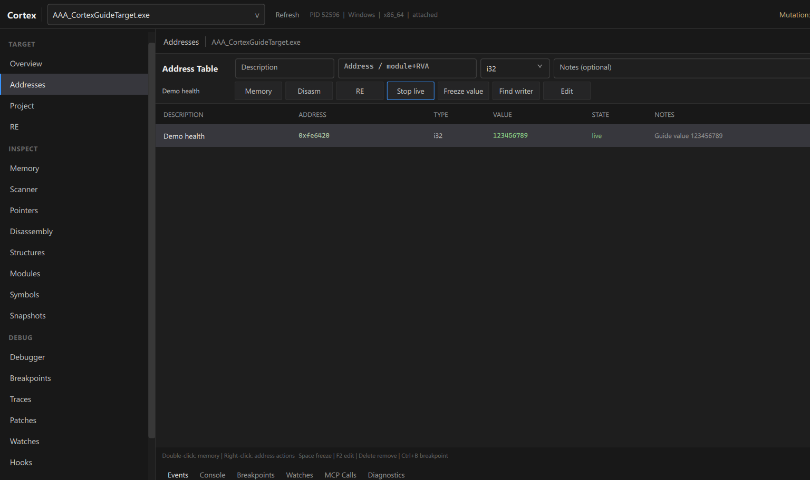
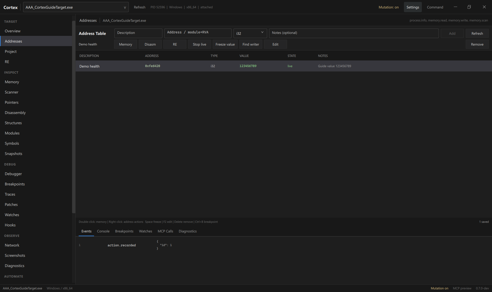
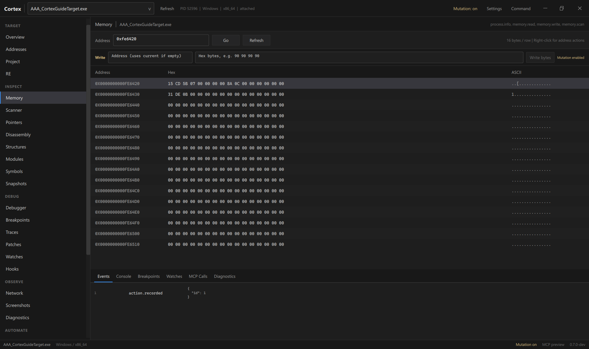
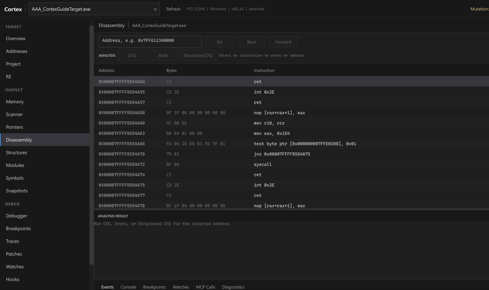
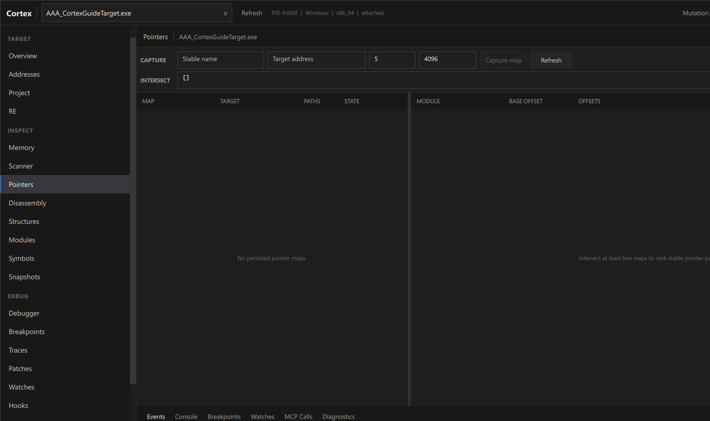
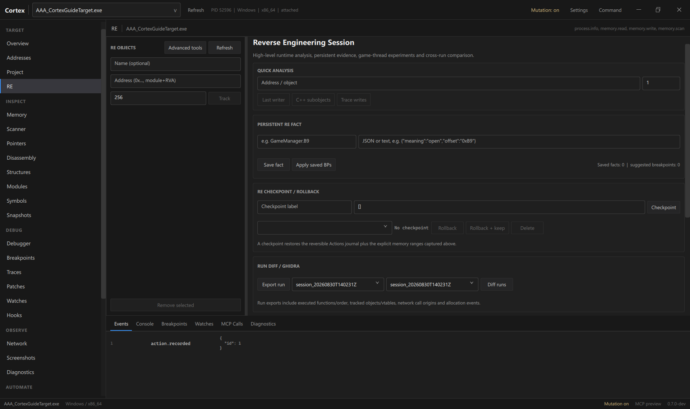

# Illustrated Cortex UI walkthrough

This walkthrough covers the main workflow of the unified Qt/QML Cortex application: select a target, scan a value, keep useful addresses, inspect memory and code, use the debugger, and continue into reverse-engineering tools.

The screenshots were captured from the actual Windows framebuffer of the unified Cortex preview while using a small local demonstration target (`AAA_CortexGuideTarget.exe`). The value `123456789` and every visible address are demonstration data only.

> Use Cortex only with software and systems you own or are authorized to inspect.

## 1. Launch Cortex and select a target

Run `cortex.exe`, then open the process picker from the top bar. The search field can filter by process name, PID, or path.



Click the process you want to inspect. Cortex attaches to it and keeps the selected target visible in the top bar and status bar.

You can reopen the picker and attach a second process. Cortex keeps both sessions open, marks the displayed target as **ACTIVE** and the other as **ATTACHED**, and switches back to an attached target without detaching the others.

## 2. Verify the attachment

Open **Overview** and verify at least:

- the process name;
- platform and architecture;
- **Session: Attached**;
- **Mutation: Disabled** after attach.



Cortex starts in observation mode. Keep **Mutation off** while you are only reading, scanning, disassembling, or inspecting state.

## 3. Scan for a value

Open **Scanner** from the sidebar or press `Ctrl+F`.

Typical exact-value workflow:

1. choose the value type (`i32`, `i64`, `f32`, `f64`, and so on);
2. enter the current value;
3. click **New Scan**;
4. change the value in the target when appropriate;
5. use **Next Scan** with a new exact value or one of the comparative modes: Changed, Unchanged, Increased, or Decreased.

In the demonstration below, Cortex found four occurrences of `123456789`.



Right-click a result to use address actions immediately. Double-click sends the result toward **Addresses**.

### Mutation and persistent Addresses entries

Scanning itself is observational and works with Mutation off. Persisting or modifying project-backed state is protected by Mutation permission, so enable Mutation only when you intentionally need that operation.

## 4. Use Addresses as the working table

**Addresses** is the main CE-like working table. Each entry contains:

- Description;
- Address;
- Type;
- Value;
- State;
- Notes.

The demonstration entry below is named `Demo health`; a live watch is enabled so Cortex keeps its value refreshed.



Useful shortcuts in Addresses:

| Shortcut | Action |
|---|---|
| `Space` | Freeze / unfreeze the selected entry |
| `F2` | Edit the selected entry |
| `Delete` | Remove the selected entry when Mutation is allowed |
| `Ctrl+B` | Add a software breakpoint when runtime support is available |

Double-click an Address entry to browse its memory.

## 5. Use the shared address context menu

The same address menu is available from **Addresses**, **Scanner**, **Memory**, **Disassembly**, and debugger disassembly.



Depending on target capabilities and permissions, actions include:

- Browse memory;
- Disassemble;
- Open in RE;
- Add to Addresses;
- Add software breakpoint;
- Find what writes;
- Find what accesses;
- Pointer scan;
- Open in Structures;
- Track object in RE;
- Detect C++ subobjects;
- create a local snapshot;
- copy the absolute address or `module+offset` form.

This menu is the fastest way to continue analysis without copying addresses between workspaces.

## 6. Inspect memory

**Memory** displays 16 bytes per row with hexadecimal and ASCII views.



The **Write** area is intentionally separated and marked as a Mutation action. Do not use it for read-only inspection.

Press `Ctrl+G` to open the global Go To dialog. It accepts forms such as:

```text
0x7FF612340000
game.exe+0x1234
KnownSymbolName
```

A resolved location can be opened in Memory, Disassembly, RE, or Addresses.

## 7. Move into Disassembly

**Disassembly** shows code around an address and keeps Back / Forward navigation history.



Main analysis actions include:

- **CFG** — control-flow graph analysis;
- **Xrefs** — references to/from the analyzed area;
- **Structured CFG** — structured function analysis;
- right-click — the shared address context menu.

`Ctrl+B` can add a software breakpoint when Mutation and runtime support are available.

## 8. Use the Debugger

Open **Debugger** when you need thread state, registers, breakpoints, or stepping. If runtime instrumentation is not active yet, use **Enable Runtime**.



The Debugger workspace combines:

- thread and paused-thread state;
- instruction pointer;
- nearby disassembly;
- registers;
- breakpoints;
- **Pause**, **Continue**, **Step Into** and **Step Over**.

Target-control actions require Mutation permission.

## 9. Continue into RE

For deeper runtime reverse engineering, open the current address in **RE**.



The RE workspace includes:

- tracked objects;
- Quick Analysis;
- Last writer analysis;
- C++ subobject detection;
- write / transition tracing;
- persistent RE facts;
- experiments with rollback;
- sessions and checkpoints;
- advanced JSON/Ghidra-oriented tools when enabled.

Recommended progression:

```text
Scanner -> Addresses -> Memory / Disassembly -> RE
                           |             |
                           +-> Pointers <-+
                           +-> Structures
                           +-> Debugger
```

## 10. Configure the interface

Open **Settings** from the top bar.


Current settings include:

- compact density;
- mouse-wheel speed;
- persistent scrollbars;
- restore last section;
- remember window layout;
- show advanced RE tools by default;
- live auto-refresh interval;
- default action for new breakpoints;
- process-global hardware-breakpoint behavior.

**Mutation is intentionally not remembered as enabled.** A new attach starts with Mutation off.

## Global shortcuts

| Shortcut | Action |
|---|---|
| `Ctrl+F` | Open Scanner and focus the value field |
| `Ctrl+G` | Global Go To |
| `Ctrl+Shift+P` or `Ctrl+K` | Command Palette |
| `Ctrl+J` | Toggle the bottom panel |
| `Ctrl+B` | Breakpoint in compatible address-aware views |

## Bottom panel

The bottom panel contains:

- Events;
- Console;
- Breakpoints;
- Watches;
- MCP Calls;
- Diagnostics.

It keeps live information available without replacing the current workspace.

## Quick validation checklist

- [ ] select and attach a target;
- [ ] verify Overview;
- [ ] perform a New Scan and a Next Scan;
- [ ] send a useful address to Addresses;
- [ ] verify its live value;
- [ ] test `Ctrl+G`;
- [ ] open Memory and Disassembly;
- [ ] enable Mutation and test only a safe, reversible change;
- [ ] enable runtime support and inspect Debugger;
- [ ] open an address in RE;
- [ ] detach and reattach cleanly;
- [ ] close Cortex without a crash.

For the complete reference of every workspace, see the [Cortex UI guide](ui-guide.md). For a shorter first-session guide, see [Getting started](getting-started.md). A French translation of this walkthrough is available in [ui-walkthrough-fr.md](ui-walkthrough-fr.md).